<div align="center">
  
### 🛡️ Cybersecurise

### แอปป้องกันภัยไซเบอร์สำหรับคนไทย ขับเคลื่อนด้วย AI/NLP

*สแกน SMS มิจฉาชีพ ตรวจสอบ Blacklist และฝึกภูมิคุ้มกันไซเบอร์*

[](https://www.nectec.or.th)

[](https://kotlinlang.org)
[](https://python.org)
[](https://fastapi.tiangolo.com)
[](https://firebase.google.com)
[](https://jupyter.org)

[](https://github.com/gong-sn-ix-ii/Cybersecurise)
[](https://github.com/gong-sn-ix-ii/Cybersecurise)
[](https://gong-ix-ii-dev.com)

</div>

---

## 🎯 ที่มาของโปรเจกต์

ทุกวันนี้คนไทยตกเป็นเหยื่ออาชญากรรมไซเบอร์เพิ่มขึ้นทุกปี — โดนหลอกผ่าน SMS แอบอ้างเป็นธนาคาร, ลิงก์ปลอม, หรือเบอร์ Call Center มิจฉาชีพ ความเสียหายระดับชาติแตะ **หลักหมื่นล้านบาทต่อปี**

ผมตั้งคำถามว่า — *ถ้ามือถือของเราสามารถ "รู้ทันมิจฉาชีพ" ได้ตั้งแต่ข้อความเด้งเข้ามา จะช่วยลดเหยื่อได้แค่ไหน?*

**Cybersecurise** คือคำตอบของคำถามนั้น — แอปที่ฝัง AI/NLP ลงในเครื่องโดยตรง วิเคราะห์ข้อความภาษาไทยแบบ **Real-time** บอกได้ว่าข้อความไหน *Scam, Spam, OTP, หรือปลอดภัย*
ไม่ใช่แค่ตรวจ SMS — แอปนี้ยังตรวจการตั้งค่ามือถือที่เปิดช่องโหว่ให้มิจฉาชีพ, เช็คเลขบัญชี/เบอร์โทรกับ Blacklist สากล, และมีแบบทดสอบฝึกความรู้ด้านไซเบอร์ให้ผู้ใช้ด้วย

> 🏆 **โปรเจกต์นี้ได้รับเลือกเข้ารอบชิงชนะเลิศระดับประเทศ NSC 2024** — โครงการการแข่งขันพัฒนาโปรแกรมคอมพิวเตอร์แห่งประเทศไทย ครั้งที่ 26 จัดโดย NECTEC & NSTDA

---

## ⚡ ฟีเจอร์หลัก 5 ระบบ

### 1️⃣ AI SMS Threat Detection — ตรวจ SMS มิจฉาชีพแบบ Real-time

หัวใจของแอปนี้ ผมและทีมเทรน NLP Model ภาษาไทยจนได้ความแม่นยำ **95%** จากนั้น Deploy Model และสร้างเป็น API สำหรับเข้าถึงโมเดลและใช้งานเพื่อตรวจสอบ SMS โดยแอปจะคัดกรองและจำแนกเป็น 4 ประเภท: *Scam / Spam / OTP / Normal* — ผู้ใช้เห็นป้ายสีและไอคอนแยกชัดเจน

### 2️⃣ Vulnerability Scanner — ตรวจการตั้งค่าที่เป็นช่องโหว่

มิจฉาชีพหลายเคสยึดเครื่องเหยื่อได้เพราะ Setting บางตัวเปิดทิ้งไว้ (เช่น Install from Unknown Sources, Accessibility Service) แอปจะสแกนการตั้งค่าทั้งหมด, ให้คะแนนความเสี่ยง, และ **นำทางไปปิด setting นั้นโดยตรง** พร้อมอธิบายว่าเปิดไว้แล้วอันตรายอย่างไร

### 3️⃣ Application Risk Assessment — ตรวจสิทธิ์การเข้าถึงของแต่ละแอป

ประเมินความเสี่ยงของทุกแอปที่ติดตั้งในเครื่อง โดยวิเคราะห์ **Permission ที่ขอ** — แอปที่ขอเข้าถึง SMS, Contacts, และ Accessibility พร้อมกัน หรือขอสิทธิ์ที่ไม่สมเหตุสมผลกับฟังก์ชันของแอป จะถูกคำนวณ **App Risk Score** ออกมาเป็นเปอร์เซ็นต์ความอันตราย พร้อมแสดงเหตุผลให้ผู้ใช้ตัดสินใจว่าควรลบแอปนั้นทิ้งหรือไม่

### 4️⃣ Blacklist Lookup — เช็คเลขบัญชี / เบอร์โทร / ชื่อ

เชื่อมต่อกับ API ของ **CheckGon** และ **ChaladOhn** (ฐานข้อมูล Blacklist ของไทย) ผู้ใช้กรอกเลขบัญชีก่อนโอนเงิน หรือเบอร์โทรก่อนรับสาย — ระบบจะเช็คกลับมาภายในไม่กี่วินาทีว่าเคยถูกรายงานเป็นมิจฉาชีพหรือไม่ พร้อมแสดงรายละเอียดเคสที่เคยมีคนแจ้ง

### 5️⃣ Cybersecurity Quiz — ฝึกภูมิคุ้มกันไซเบอร์

เทคโนโลยีอย่างเดียวไม่พอ — ผู้ใช้ต้อง "รู้ทัน" กลลวงด้วย แอปจึงมีแบบทดสอบหลายหมวดให้ผู้ใช้ฝึกแยกแยะกลโกงรูปแบบต่าง ๆ ผ่านสถานการณ์จำลอง ช่วยสร้างภูมิคุ้มกันระยะยาว ไม่ใช่แค่พึ่งระบบเตือน

---

## 🏗️ สถาปัตยกรรม & เทคโนโลยี

```
┌─────────────────────────────────────────────┐
│         Android App (Kotlin)                │
│  ┌───────────────────────────────────────┐  │
│  │   On-device NLP Model (95% accuracy)  │  │
│  │   • SMS Classification                │  │
│  └───────────────────────────────────────┘  │
└──────────────────┬──────────────────────────┘
                   │
                   ├─── 🔥 Firebase (Auth + Real-time DB)
                   ├─── 🔍 CheckGon API (Blacklist)
                   └─── 🔍 ChaladOhn API (Blacklist)

         🧠 ML Pipeline (Development Time)
         Python + Jupyter Notebook
         ├─ Data Preprocessing
         ├─ NLP Model Training
         └─ FastAPI (Testing Endpoint)
```

| Stack | บทบาท |
|---|---|
| **Kotlin** | ภาษาหลักของแอป Android |
| **Python + Jupyter** | สร้างและเทรน NLP Model |
| **FastAPI** | API สำหรับทดสอบ Model ก่อนฝังลงเครื่อง |
| **Firebase** | Authentication + Real-time Database |
| **CheckGon / ChaladOhn API** | Blacklist Lookup ภายนอก |

---

## 📱 หน้าจอการใช้งาน

แอปมี **25 หน้าจอ** แบ่งตามฟีเจอร์ดังนี้ ⤵️

### 🎬 Onboarding & Authentication

<table>
<tr>
<td width="25%">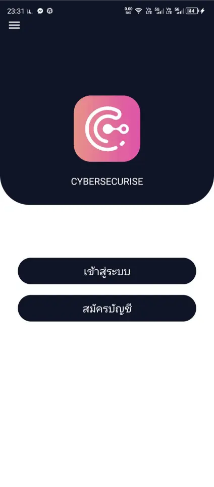<br/><b>Welcome</b><br/>หน้าแรกของแอป</td>
<td width="25%">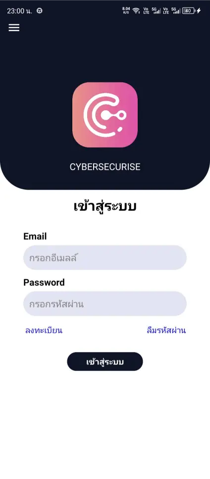<br/><b>เข้าสู่ระบบ</b><br/>User Authentication</td>
<td width="25%">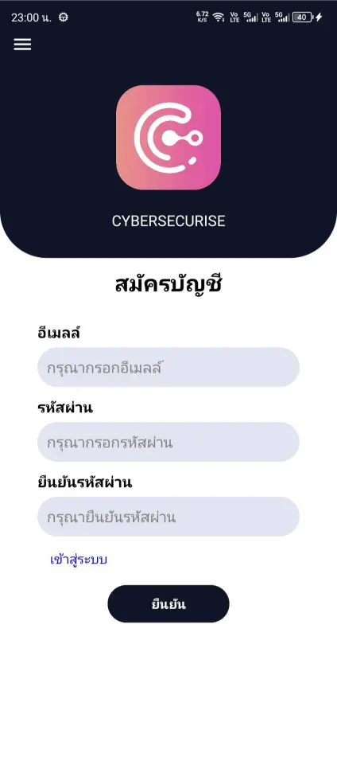<br/><b>สมัครสมาชิก</b><br/>สร้างบัญชีใหม่</td>
<td width="25%">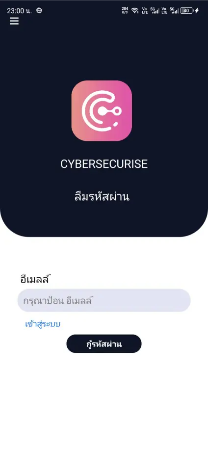<br/><b>ลืมรหัสผ่าน</b><br/>Password Recovery</td>
</tr>
</table>

### 🏠 Main Hub & Knowledge

<table>
<tr>
<td width="50%">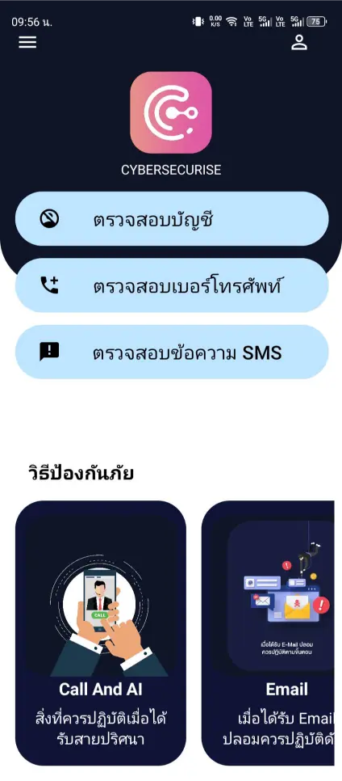<br/><b>Main Dashboard</b> — หน้าหลักรวมทุกฟีเจอร์</td>
<td width="50%">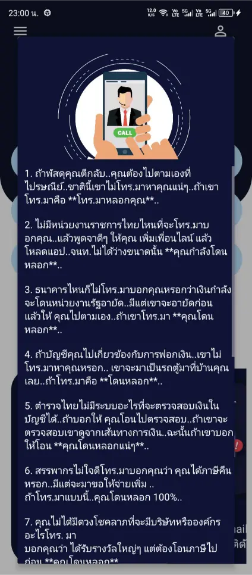<br/><b>Knowledge Hub</b> — คำแนะนำการรับมือมิจฉาชีพรูปแบบต่าง ๆ</td>
</tr>
</table>

### 💳 Blacklist Lookup (เช็คก่อนโอน)

<table>
<tr>
<td width="25%">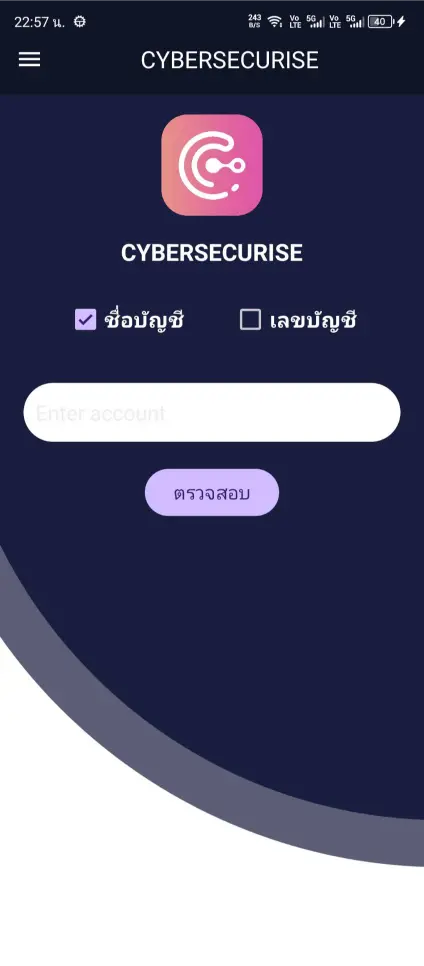<br/><b>Account Verification</b></td>
<td width="25%">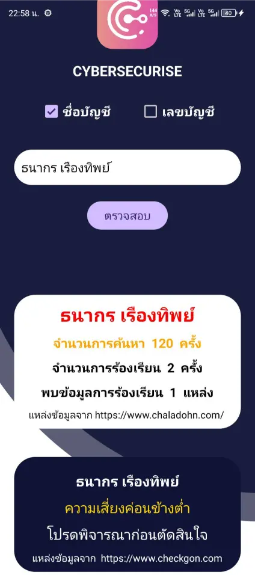<br/><b>Verification Results</b></td>
<td width="25%">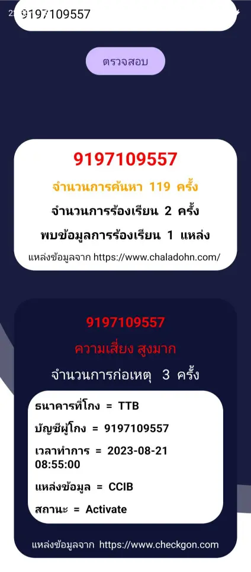<br/><b>Bank Account Lookup</b></td>
<td width="25%">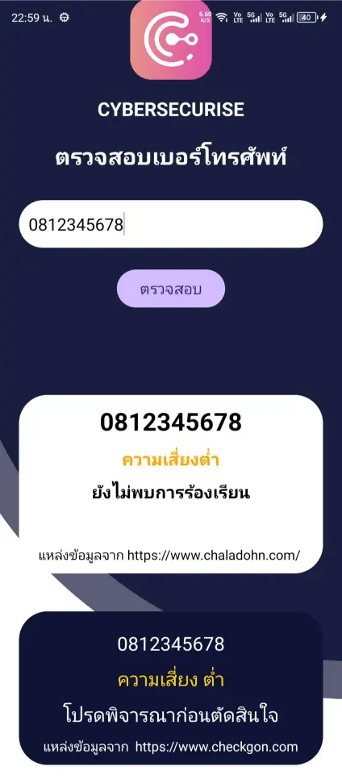<br/><b>Phone Number Lookup</b></td>
</tr>
</table>

### 🤖 AI SMS Threat Detection (หัวใจของแอป)

<table>
<tr>
<td width="33%">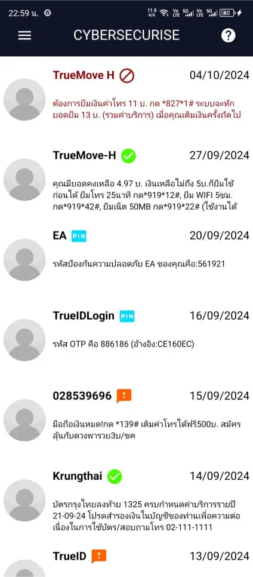<br/><b>AI SMS Detection</b><br/>คัดกรอง SMS ด้วย AI</td>
<td width="33%">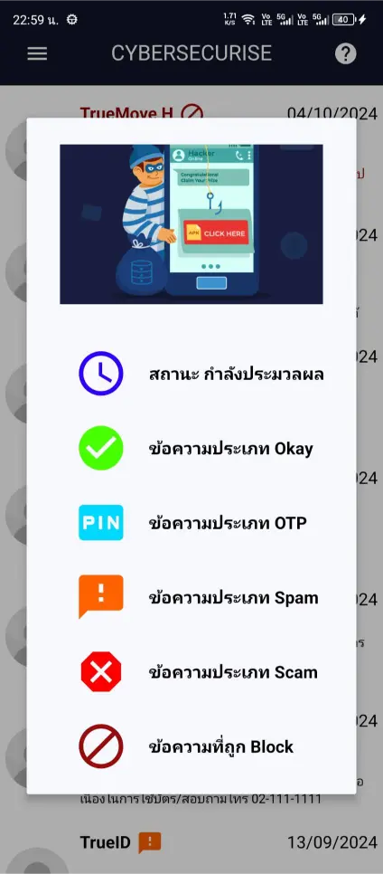<br/><b>Threat Categories</b><br/>หมวดหมู่และไอคอน</td>
<td width="33%">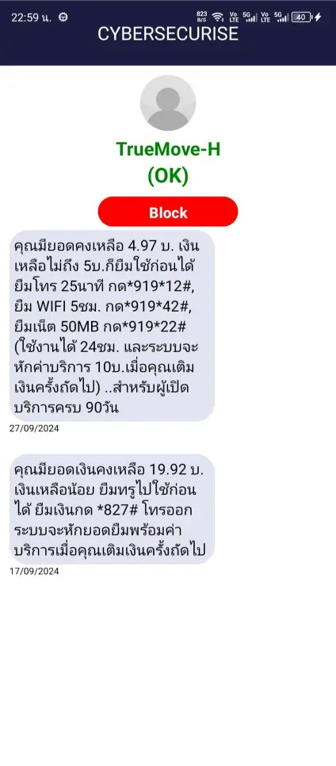<br/><b>Message Analysis</b><br/>รายละเอียดผลวิเคราะห์</td>
</tr>
<tr>
<td width="33%">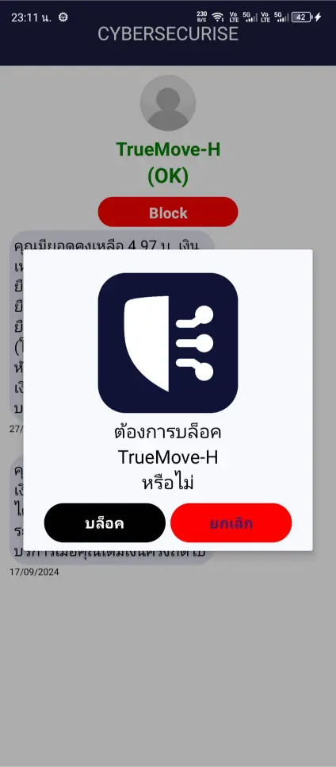<br/><b>Block Confirmation</b><br/>ยืนยันบล็อกข้อความ</td>
<td width="33%">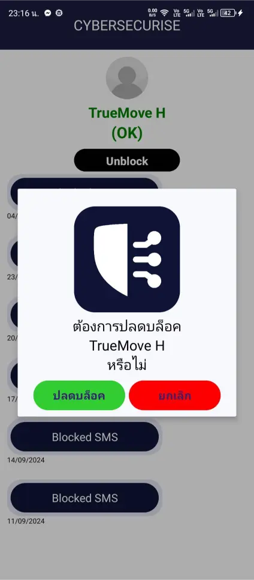<br/><b>Unblock</b><br/>ปลดบล็อกข้อความ</td>
<td width="33%">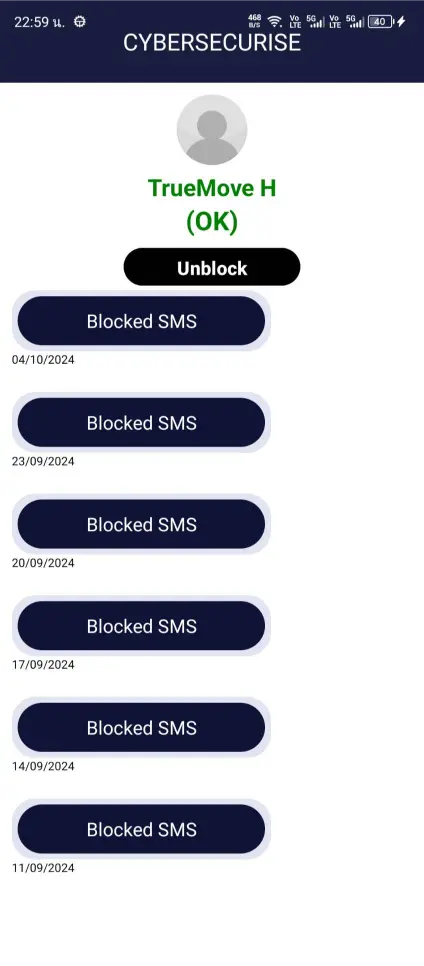<br/><b>Quarantined Messages</b><br/>ข้อความอันตรายที่ถูกกักไว้</td>
</tr>
</table>

### 🛡️ Vulnerability Scanner & App Risk

<table>
<tr>
<td width="25%">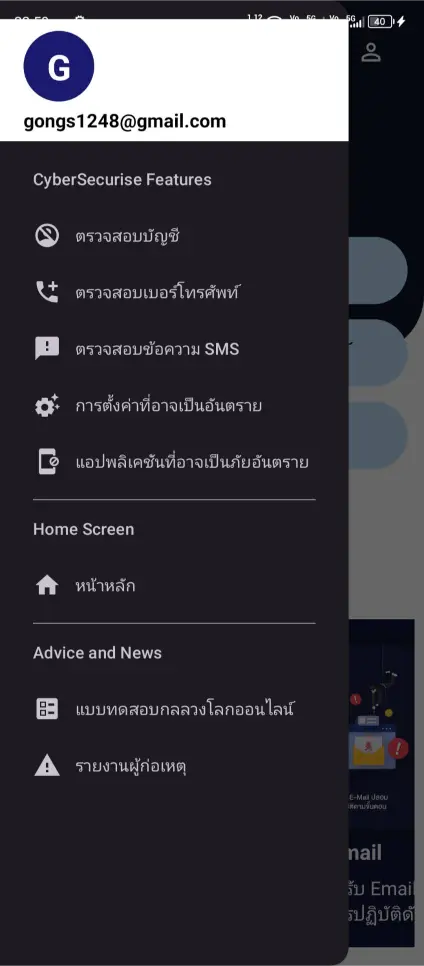<br/><b>Navigation Menu</b></td>
<td width="25%">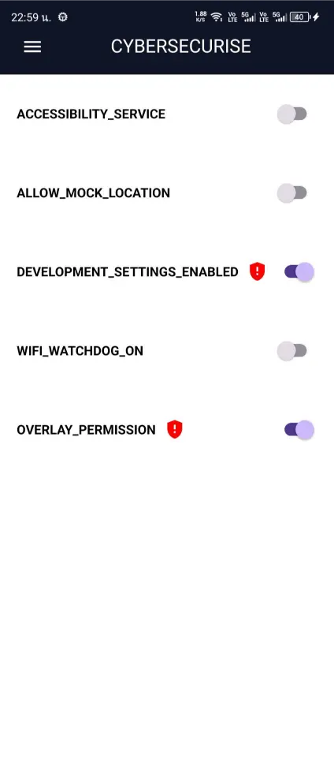<br/><b>Vulnerability Scanner</b><br/>ตรวจ Setting อันตราย</td>
<td width="25%">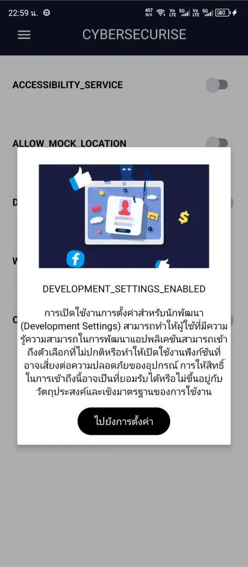<br/><b>Security Remediation</b><br/>นำทางไปแก้ไข</td>
<td width="25%">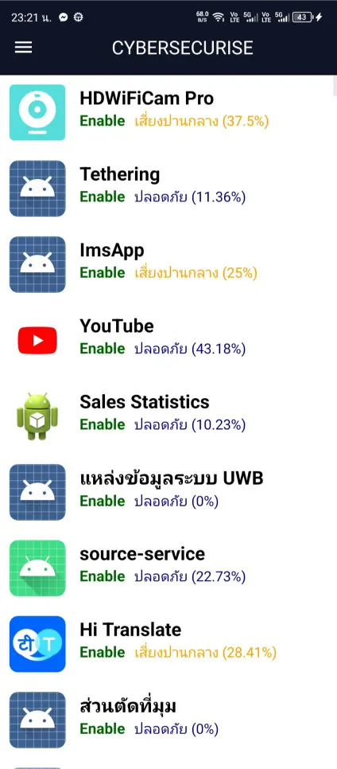<br/><b>App Risk Assessment</b><br/>ประเมินความเสี่ยงแอป</td>
</tr>
<tr>
<td width="25%">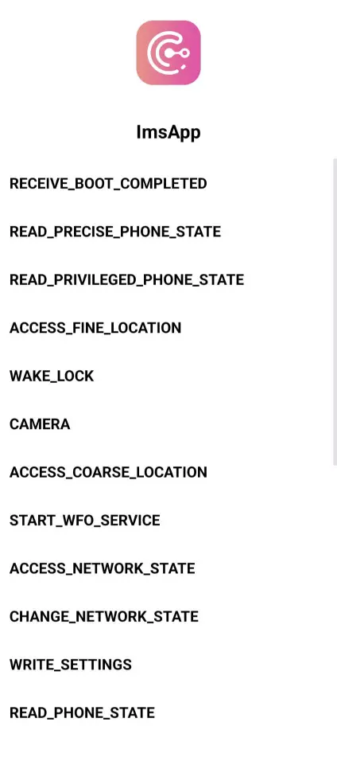<br/><b>Permission Audit</b><br/>ตรวจสิทธิ์การเข้าถึง</td>
<td width="25%">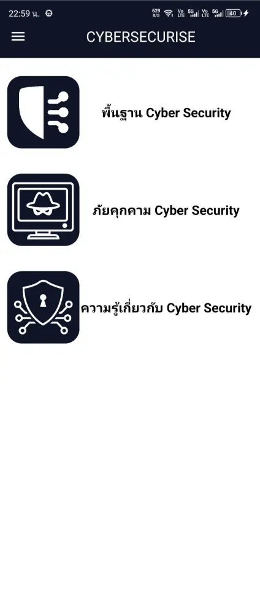<br/><b>Quiz Module</b><br/>แบบทดสอบ</td>
<td width="25%">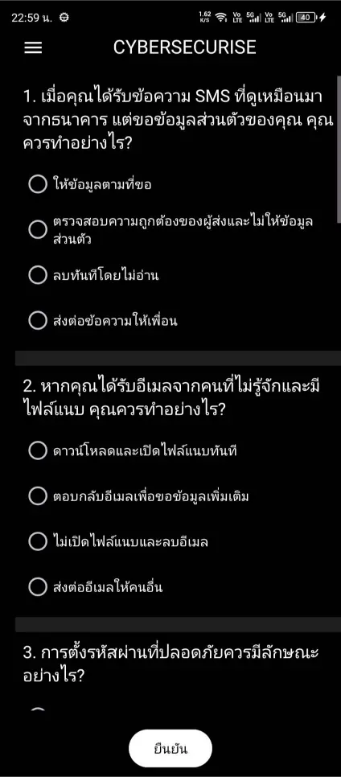<br/><b>Quiz Categories</b><br/>หมวดหมู่แบบทดสอบ</td>
<td width="25%">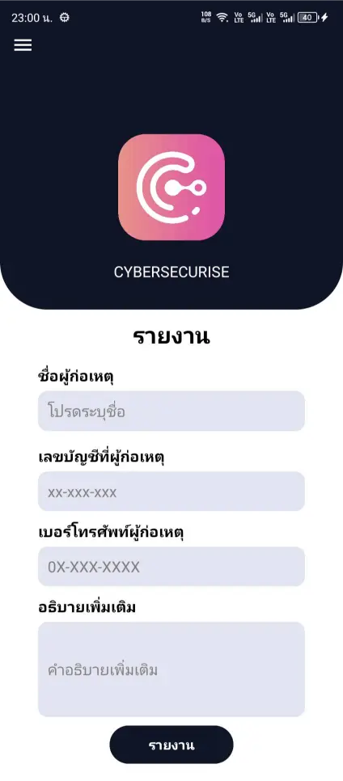<br/><b>Help & Support</b><br/>ช่องทางขอความช่วยเหลือ</td>
</tr>
</table>

---

## 🏆 NSC 2024 — เส้นทางสู่รอบชิงชนะเลิศ

โปรเจกต์นี้ส่งเข้าประกวด **โครงการการแข่งขันพัฒนาโปรแกรมคอมพิวเตอร์แห่งประเทศไทย ครั้งที่ 26 (NSC 2024)** จัดโดย **NECTEC** ร่วมกับ **NSTDA**

| | รายละเอียด |
|---|---|
| 🏅 **สถานะ** | National Finalist (รอบชิงชนะเลิศระดับประเทศ) |
| 📅 **ปีการแข่งขัน** | NSC 2024 (ครั้งที่ 26) |
| 🏛️ **หน่วยงาน** | NECTEC & NSTDA |
| 📋 **หมวด** | Cybersecurity / Anti-Fraud |

> หลังจากผ่านการนำเสนอต่อคณะกรรมการในรอบชิงชนะเลิศ ผมได้รับ Feedback เชิงเทคนิคจากผู้เชี่ยวชาญทั้งด้าน AI/NLP และ Mobile Security — เป็นประสบการณ์ที่ผลักดันให้ผมพัฒนาตัวเองในสายนี้ต่อไปอย่างจริงจัง

---

## 💡 บทเรียนจากการพัฒนา

ยกระดับทักษะจากการเขียนแค่ฝั่ง Mobile สู่การทำ End-to-End Integration โดยนำโมเดล NLP ไป Deploy ขึ้น Hugging Face และออกแบบ Backend API ด้วย FastAPI (Python) เพื่อให้แอปพลิเคชัน (Kotlin) สามารถส่งข้อมูล SMS ไปประมวลผลได้อย่างแม่นยำ ทำให้ผมเข้าใจสถาปัตยกรรมการแยกส่วนระบบ (Client-Server) 

### ⚡ Performance Optimization

เมื่อต้องประมวลผลผ่าน API ความท้าทายหลักคือ Network Latency ตอนแรกแอปเกิดอาการค้าง (UI Blocking) ระหว่างรอผลสแกน ผมจึงต้องปรับปรุงการทำ Asynchronous Programming (การจัดการ Thread/Coroutines) จัดการ Loading State และ Timeout ให้ดีขึ้น

### 🎤 Communication & Pitching

ตอนนำเสนอ NSC เป็นครั้งแรกที่ผมต้องอธิบาย **เรื่องเทคนิคซับซ้อนให้คณะกรรมการระดับชาติเข้าใจในเวลาจำกัด** ฝึกการตัดส่วนที่ไม่จำเป็น เน้น Impact ของผู้ใช้จริง และเรียนรู้การทำงานเป็นทีมในสถานการณ์กดดัน

---

## 🚀 วิธีติดตั้งและใช้งาน

> ⚠️ **หมายเหตุ:** ยังไม่เปิดเผย SourceCode เพื่อนำไปพัฒนาต่อ แอปนี้พัฒนาเพื่อ Android เท่านั้น (Kotlin) เพราะต้องการสิทธิ์เข้าถึง SMS / System Settings ระดับลึก ซึ่ง iOS ไม่อนุญาต

## 👨‍💻 ผู้พัฒนา

<table>
<tr>
<td>

### Kitsada Khamnuan (กฤษฎา คำนวน)

*Junior Software Engineer · Cybersecurity Enthusiast · AI Application Developer*

📍 ชลบุรี / กรุงเทพฯ, ประเทศไทย

🌐 **Portfolio:** [gong-ix-ii-dev.com](https://gong-ix-ii-dev.com)
💼 **GitHub:** [@gong-sn-ix-ii](https://github.com/gong-sn-ix-ii)
💬 **LinkedIn:** [Kitsada Khamnuan](https://www.linkedin.com/in/kitsada-khamnuan-2a6729407/)

</td>
</tr>
</table>

---

## 📄 License

โปรเจกต์นี้พัฒนาเพื่อการศึกษาและการแข่งขัน NSC 2024 ส่วนของ NLP Model และ Source Code มีลิขสิทธิ์ของผู้พัฒนา — กรุณาติดต่อก่อนนำไปใช้ในเชิงพาณิชย์หรือทำซ้ำ

---

<div align="center">

### 🛡️ "เทคโนโลยีที่ดี ควรทำให้ผู้ใช้ปลอดภัยยิ่งขึ้น — ไม่ใช่เก็บข้อมูลของเขาเพิ่ม"

**⭐ ถ้าคุณชอบโปรเจกต์นี้ ฝากกด Star เป็นกำลังใจให้ผู้พัฒนาด้วยนะครับ ⭐**

Made with 💜 by [Kitsada Khamnuan](https://gong-ix-ii-dev.com) · NSC 2024 Finalist 🏆

</div>

---

